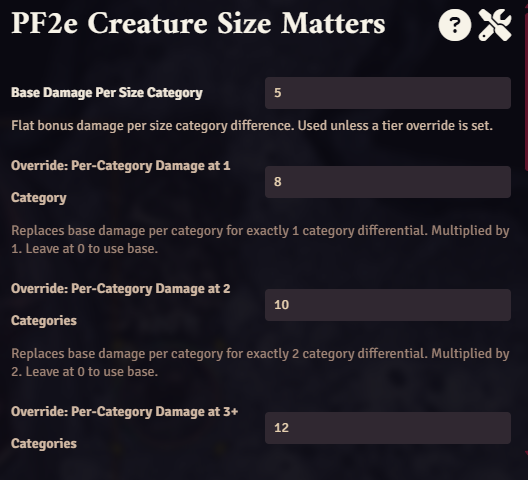
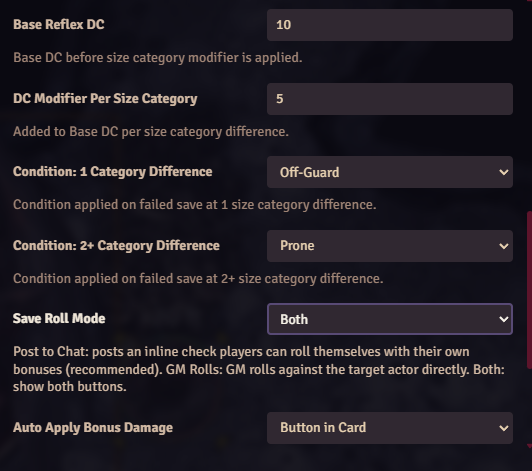
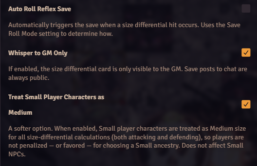
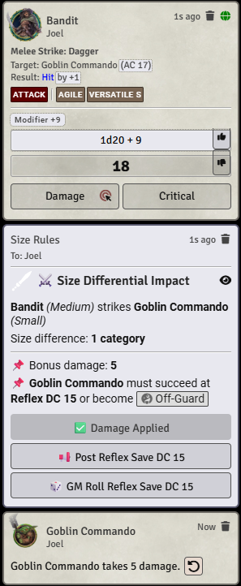
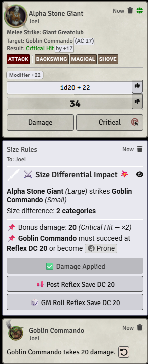

# PF2e Creature Size Matters

A Foundry VTT module for **Pathfinder 2e** that adds meaningful mechanical weight
to size differentials in melee combat.

## The Problem

PF2e normalizes damage across creature sizes — a Huge giant hitting a Medium
adventurer deals damage appropriate to the level differential, not the *size*
differential. The terror of fighting something three times your size has no
mechanical expression. This module fixes that.

## What It Does

When a larger creature successfully hits a smaller one in **melee combat**, the
module posts a GM-only card to chat that:

- Calculates the size category difference between attacker and target
- Prompts the GM to apply **bonus damage** scaled to the size differential
- Requires the target to make a **Reflex save** or suffer a condition
- Provides **draggable condition links** to apply directly to the token on a failed save
- Automatically **doubles bonus damage** on a critical hit (configurable)
- Posts an **inline save check** to public chat for players to roll themselves

## Size Categories

| Size | Category |
|------|----------|
| Tiny | 0 |
| Small | 1 |
| Medium | 2 |
| Large | 3 |
| Huge | 4 |
| Gargantuan | 5 |

A Large creature (3) striking a Small creature (1) has a **2 category differential**.

---

## Configuration

All settings are found under **Game Settings → Module Settings → PF2e Creature
Size Matters**.

---

### Damage Settings

  

#### Base Damage Per Size Category
**Default: 5**

The flat bonus damage applied per size category difference when no tier override
is set.

- 1 category difference → 5 × 1 = **5** damage
- 2 category difference → 5 × 2 = **10** damage
- 3 category difference → 5 × 3 = **15** damage

#### Override: Per-Category Damage at 1 Category
**Default: 0 (disabled)**

Replaces the base damage per category for exactly 1 size category difference.
Multiplied by 1. Leave at **0** to use the base value.

#### Override: Per-Category Damage at 2 Categories
**Default: 0 (disabled)**

Replaces the base damage per category for exactly 2 size category difference.
Multiplied by 2. Leave at **0** to use the base value.

#### Override: Per-Category Damage at 3+ Categories
**Default: 0 (disabled)**

Replaces the base damage per category for 3 or more size category differentials.
Multiplied by the actual size difference. Leave at **0** to use the base value.

**Example with overrides set to 8, 10, 12:**

| Attacker | Target | Categories | Calculation | Bonus Damage |
|----------|--------|------------|-------------|--------------|
| Large | Medium | 1 | 8 × 1 | **8** |
| Large | Small | 2 | 10 × 2 | **20** |
| Huge | Small | 3 | 12 × 3 | **36** |
| Gargantuan | Small | 4 | 12 × 4 | **48** |
| Gargantuan | Tiny | 5 | 12 × 5 | **60** |

#### Double Bonus Damage on Critical Hit
**Default: Enabled**

When **enabled** — bonus damage is automatically doubled on a critical hit.
A single apply button appears showing the doubled value.

When **disabled** — on a critical hit, two buttons appear in the card:
- **Apply X Damage (Normal)** — applies the standard bonus
- **Apply X Damage (Critical ×2)** — applies the doubled bonus

The GM chooses which to apply.

---

### Save Settings

#### Base Reflex DC
**Default: 10**

The base DC for the Reflex save before the per-category modifier is applied.

#### DC Modifier Per Size Category
**Default: 5**

Added to the Base DC per size category difference.

Formula: `Base DC + (DC Modifier × size difference)`

| Categories | Default Calculation | DC |
|------------|--------------------|----|
| 1 | 10 + (5 × 1) | **15** |
| 2 | 10 + (5 × 2) | **20** |
| 3 | 10 + (5 × 3) | **25** |
| 4 | 10 + (5 × 4) | **30** |

#### Condition: 1 Category Difference
**Default: Off-Guard**

The condition applied to the target on a failed Reflex save when the attacker
is 1 size category larger.

| Option | Effect |
|--------|--------|
| Off-Guard | Target loses their Dexterity bonus to AC |
| Clumsy 1 | Target takes -1 to Dexterity-based checks and DCs |
| None | No condition — damage prompt only |

#### Condition: 2+ Category Difference
**Default: Prone**

The condition applied to the target on a failed Reflex save when the attacker
is 2 or more size categories larger.

| Option | Effect |
|--------|--------|
| Prone | Target is knocked down, -2 AC vs melee, -4 AC vs ranged |
| Off-Guard | Target loses their Dexterity bonus to AC |
| None | No condition — damage prompt only |

The condition appears as a **draggable link** in the GM card — drag it directly
onto the target token to apply after a failed save.

---

### Save Roll Mode

  

**Default: Post to Chat**

Controls how the Reflex save is handled when the save button is clicked or
auto-roll is enabled.

| Option | Behavior |
|--------|----------|
| **Post to Chat** *(default)* | Posts an inline Reflex save check to **public chat**. Players click it and roll themselves with all their own bonuses applied. |
| **GM Rolls** | GM rolls the save against the target actor directly from the server side. |
| **Both** | Both buttons appear on the GM card — Post to Chat and GM Roll independently. |

**Post to Chat** is the recommended default — players roll with their own
character's bonuses, feats, and items properly applied. The save appears
publicly in chat and is preserved in the session log.

---

### Automation Settings

#### Auto Apply Bonus Damage
**Default: Button in Card**

Controls how bonus damage is applied.

| Option | Behavior |
|--------|----------|
| Manual | Card displays the damage value — GM applies it manually |
| Button in Card | A button appears in the card — click to apply damage to the target |
| Auto Apply | Damage is applied to the target automatically on hit |

#### Auto Roll Reflex Save
**Default: Disabled**

When **enabled** — the save is automatically triggered the moment a qualifying
hit occurs, using the **Save Roll Mode** setting to determine how:

- **Post to Chat** — automatically posts the inline check to public chat
- **GM Rolls** — automatically rolls the target's save server-side
- **Both** — does both automatically

When **disabled** — the appropriate button(s) appear on the GM card for manual
triggering.

---

### Display Settings

#### Whisper to GM Only
**Default: Enabled**

When **enabled** — the size differential GM card is only visible to the GM.

When **disabled** — the card is visible to all players.

> **Note:** Save posts to chat via **Post to Chat** mode are always public
> regardless of this setting.

---

### Player Friendliness

#### Treat Small Player Characters as Medium
**Default: Enabled**

A softer option for tables that don't want size category to penalize a
player's choice of ancestry. When **enabled**, Small **player characters**
(gnomes, goblins, halflings, etc.) are treated as Medium for the purposes of
this module's size-differential calculations — both when they're the target
of an attack and when they're the one attacking.

This is intentionally one rule applied symmetrically: a Small PC neither
takes bonus damage for being smaller than a Medium+ attacker, nor deals
bonus damage for being smaller than a Medium+ target. It simply removes
size from the equation for that PC, in both directions.

When **disabled**, Small PCs are treated exactly like any other Small
creature for all calculations.

> **Note:** This setting only affects **player characters** (actors of type
> `character`). Small NPCs and monsters are unaffected and still use their
> true size category.

The GM card reflects the normalization when it applies — a Small PC's size
label will show as `Small → Medium` so the GM can see at a glance why the
differential resolved the way it did.

### Treat Small Player Characters as Medium

  

---

## The Chat Card

When a qualifying hit occurs, a GM card appears showing:

- **Attacker and target** with their size categories
- **Size difference** in categories
- **Bonus damage** to apply (doubled automatically on crits if enabled)
- **Reflex DC** and the condition on a failed save
- A draggable **condition link** — drag onto the token after a failed save
- An **Apply Damage** button (if set to Button mode)
- A **Post Save** and/or **GM Roll Save** button (based on Save Roll Mode)

<table>
  <tr>
    <th align="center">Normal Hit</th>
    <th align="center">Critical Hit</th>
  </tr>
  <tr>
    <td align="center">
      
    </td>
    <td align="center">
      
    </td>
  </tr>
</table>

---

## Compatibility

| | Version |
|--|---------|
| Foundry VTT | 13+ |
| PF2e System | 6.0.0+ |
| Verified | Foundry 14.364, PF2e 8.2.0 |

---

## Design Notes

This module is intentionally **GM-facing** by default. The intent is to add
narrative and tactical weight to size differentials without overwhelming players
with additional mechanics they need to track. The GM sees the prompt, applies
the damage, calls for the save, and narrates the result.

Size differential only applies to **melee attacks**. Ranged attacks, spells, and abilities 
are not affected.

Bonus damage is applied via PF2e's native damage pipeline with IWR bypassed 
(skipIWR: true) — it lands as a flat HP reduction unaffected by resistances or immunities.

---

## License

MIT License — see [LICENSE](LICENSE) for details.

## Author

**Jester** — [github.com/esterlinej](https://github.com/esterlinej)
